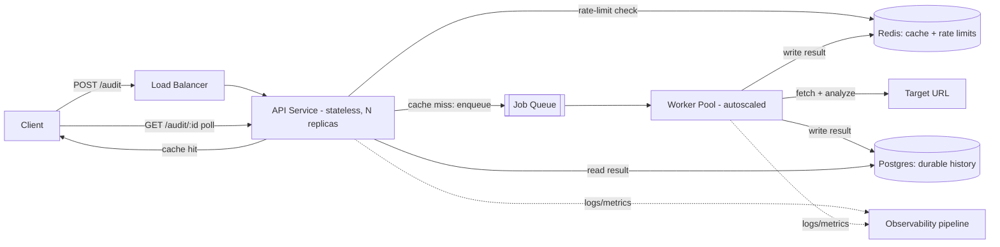

# Page Pulse — Designing for Scale

**Target load:** 10,000 audits/day (avg ~7/min), with bursts of 500 concurrent requests.
**SLA:** customer-facing response time guarantee (assume p95 < 3s for cached, p95 < 15s for fresh audits).

> Note: Task A (this repo) is a Fastify API on Node.js 20, currently with in-memory cache and rate-limiting for local development, no persistence layer, and synchronous request handling — no queue, no frontend. This document is the proposed redesign for production scale: it introduces Redis (shared cache + rate-limit state across instances), a job queue, an async worker pool, and Postgres for durable history. None of that exists in the current Task A build; that's the point of Task B — identifying what changes and why once real load requires it.

---

## a) Architecture

### Components

| Component | Responsibility |
|---|---|
| **API Gateway / Load Balancer** | TLS termination, routing, per-client rate limiting at the edge |
| **API Service (Fastify, stateless, horizontally scaled)** | Validates requests, checks cache, enqueues audit jobs, returns job status/results |
| **Cache (Redis)** | Stores recent audit results keyed by normalized URL, with configurable TTL window |
| **Job Queue (Redis Streams / BullMQ, or SQS if cloud-native)** | Buffers audit requests so bursts don't overwhelm workers |
| **Worker Pool (stateless, horizontally scaled, autoscaled)** | Pulls jobs from queue, performs the actual fetch + audit (headless browser or HTTP + parser), writes result to cache + DB |
| **Postgres (primary datastore)** | Durable audit history, per-client rate-limit counters (or Redis for counters — see below), request logs metadata |
| **Structured Logging / Metrics pipeline** | Ships logs+metrics to a central sink (e.g. CloudWatch, Datadog, or self-hosted Loki/Prometheus) |

### Data flow

1. Client sends `POST /audit {url}` to the API service via the load balancer.
2. API service validates the URL, checks per-client rate limit (Redis counter, sliding window).
3. API service normalizes the URL and checks Redis cache for a result within the configured window.
   - **Cache hit** → return immediately (this is the fast path and should dominate under normal traffic patterns, since repeat audits are common).
   - **Cache miss** → API service enqueues a job with a request ID, returns `202 Accepted` + job ID (or, for synchronous UX, holds the connection with a timeout and falls back to job-polling if it exceeds a threshold).
4. Worker pool consumes the job, performs the audit (fetch + parse/analyze), writes result to Postgres (durable record) and Redis (cache), then marks the job complete.
5. Client polls `GET /audit/{jobId}` or receives a webhook/callback with the result.

### Why async + queue rather than synchronous request/response

At 500 concurrent bursts, holding open synchronous HTTP connections while fetching third-party URLs (which can be slow, hang, or time out) would exhaust API service threads/connections fast. Decoupling accept-the-request from do-the-work via a queue means:
- The API tier absorbs bursts cheaply (enqueue is O(1ms)), which protects the SLA on the *acceptance* side.
- Worker pool can be scaled independently and autoscaled based on queue depth, not on frontend connection count.
- A slow or hanging target URL degrades one job, not the whole service.

### Where state lives

- **Ephemeral/ hot state:** Redis — cache of results (TTL-bound), rate-limit counters (sliding window), job queue.
- **Durable state:** Postgres — full audit history, client metadata, audit configuration.
- **No state in the API or worker processes themselves** — this is what allows both tiers to scale horizontally and be replaced/restarted without data loss.

### Diagram

---

## b) Technology decisions and rejected alternatives

| Decision | Chosen | Rejected alternative | Why |
|---|---|---|---|
| Queue | Redis Streams (or BullMQ on top of Redis) | SQS / RabbitMQ | At this scale (10K/day, bursts of 500), Redis is already in the stack for caching, so reusing it for queueing avoids a second infrastructure dependency and operational surface. SQS is a fine choice if already on AWS and wanting managed durability guarantees beyond Redis persistence — worth revisiting if daily volume grows 10-100x. |
| Cache | Redis with TTL per key | In-process LRU cache | An in-process cache doesn't work once the API tier has multiple replicas (each instance would have a different cache, causing inconsistent hits/misses and defeating the purpose). Redis gives one shared cache across all replicas. |
| Durable store | Postgres | MongoDB / DynamoDB | Audit records have a fairly fixed, relational shape (URL, timestamp, client, results, status) and benefit from ACID guarantees and straightforward querying for the client-facing history/dashboard use case. A document store would be justified if audit result schemas were highly variable per audit type — they aren't here. |
| Worker scaling | Horizontal autoscaling on queue depth | Vertical scaling of a single worker process | Bursts of 500 concurrent are inherently spiky; autoscaling on queue depth (or a target processing latency) lets capacity track demand instead of over-provisioning for peak 24/7. |
| Rate limiting | Sliding-window counter in Redis, enforced at the API layer | Fixed-window counter | Fixed windows allow a burst of 2x the limit at window boundaries (e.g. all requests at 11:59:59 and 12:00:01). A sliding window avoids this edge case for a small added cost in Redis command complexity. |
| Audit execution | Headless browser pool only for JS-heavy targets, plain HTTP fetch + HTML parse otherwise | Headless browser for every audit | Headless browsers (Puppeteer/Playwright) are 10-50x more resource-expensive than a plain HTTP fetch. At 10K/day with 500-concurrent bursts, defaulting every audit to a full browser would multiply infrastructure cost and reduce the safe concurrency ceiling for no benefit on the majority of static/simple pages. |

---

## c) Failure mode analysis (top 3 at this scale)

### 1. Target URL slowness/hangs consuming worker capacity
**Failure:** A subset of target URLs are slow, unresponsive, or intentionally designed to hang connections (or return huge payloads). Under a burst of 500 concurrent audits, if even 5-10% of targets hang, worker capacity can be tied up and the queue backs up, breaching the SLA for *everyone* waiting behind them.
**Mitigation:**
- Hard per-audit timeout (e.g. 10-15s) with the worker force-killing the fetch and marking the job as `timed_out` rather than letting it hang.
- Cap max response size read from target URLs to avoid memory blowup.
- Circuit-breaker per target domain: if a domain fails/times out repeatedly in a short window, short-circuit further attempts against it for a cooldown period rather than retrying blindly.

### 2. Queue backlog growth during sustained burst (thundering herd)
**Failure:** If 500 concurrent requests arrive faster than workers can drain them, the queue grows unbounded, job latency climbs, and the SLA is breached even though nothing has technically "crashed."
**Mitigation:**
- Autoscale workers on queue depth / oldest-job-age metric, not just CPU.
- Set a queue depth ceiling — beyond it, return `429`/`503` with a `Retry-After` header rather than accepting unbounded work the system can't honor, which protects the SLA for requests it *does* accept.
- Prioritize cache-hit path so it never competes with the queue — cache hits are served directly by the API tier and never touch the worker pool, so a queue backlog only affects genuinely new/uncached audits.

### 3. Cache/rate-limit store (Redis) becomes a single point of failure
**Failure:** Since both caching and rate-limiting depend on Redis, an outage or memory-pressure eviction storm there degrades both the fast path (cache) and the safety mechanism (rate limiting) simultaneously — potentially causing every request to fall through to "cache miss," overwhelming the worker pool and queue at once.
**Mitigation:**
- Run Redis in a managed, replicated mode (e.g. Redis Sentinel/Cluster, or a managed offering like ElastiCache) rather than a single instance.
- Fail open on rate-limit-check failure with a conservative default limit, rather than failing closed (rejecting everyone) or failing fully open (no protection at all) — log the degradation loudly so it's visible in monitoring.
- Set `maxmemory-policy` explicitly (e.g. `allkeys-lru`) so cache evictions are graceful rather than Redis running out of memory and erroring.

---

## d) Observability and rollback plan

### What to monitor / alert on

| Signal | Why it matters | Example alert threshold |
|---|---|---|
| p50/p95/p99 response latency (cache-hit path and full-audit path, separately) | Directly tracks SLA compliance | Alert if p95 > SLA target for 5 consecutive minutes |
| Queue depth and oldest-job-age | Leading indicator of SLA breach before it happens | Alert if oldest job age > SLA target / 2 |
| Cache hit ratio | Drop indicates cache misconfiguration, TTL too short, or traffic pattern shift | Alert on >20% drop from rolling baseline |
| Worker error rate / timeout rate | Detects target-site issues or worker bugs | Alert if error rate > 5% over 5 min |
| Rate-limit rejection rate per client | Distinguishes abusive traffic from genuine demand growth | Informational dashboard + alert on sudden spike |
| Redis memory usage and eviction rate | Early warning before Redis becomes the bottleneck (failure mode #3) | Alert at 80% memory, and on any eviction rate > 0 for the rate-limit keyspace specifically |
| 5xx rate at the API tier | Baseline health signal | Alert if > 1% over 5 min |
| Request ID traceability | Not an alert, but every log line and error response should carry the request ID so a specific customer complaint can be traced end-to-end through API → queue → worker → DB |

### Rollback plan for a bad deploy

1. **Deploy strategy:** rolling/blue-green deploy behind the load balancer, never an all-at-once cutover — new version receives a small % of traffic first (canary), monitored against the error-rate and latency alerts above before full rollout.
2. **Automated rollback trigger:** if error rate or p95 latency on the canary breaches threshold within the first N minutes, automatically shift traffic back to the previous version (most CI/CD platforms — e.g. Render, Fly.io, ECS — support this natively; otherwise a simple script comparing metrics can gate promotion).
3. **Manual rollback path:** keep the previous container image/tag deployed and ready — rollback is "redeploy last known-good image," not "revert code and rebuild," so it's fast (target: under 5 minutes from decision to rollback complete).
4. **Database migrations:** write migrations to be backward-compatible with the previous app version for at least one deploy cycle (additive changes first, destructive changes in a later, separate deploy) so a rollback never leaves the DB schema incompatible with the rolled-back code.
5. **Post-rollback:** the incident isn't closed until root cause is identified from the structured logs (traced via request ID) and a regression test is added before the fix is re-attempted.

---

*Built for Digital Heroes Training Task — see repository README for the Task A API contract and live deployment link.*
